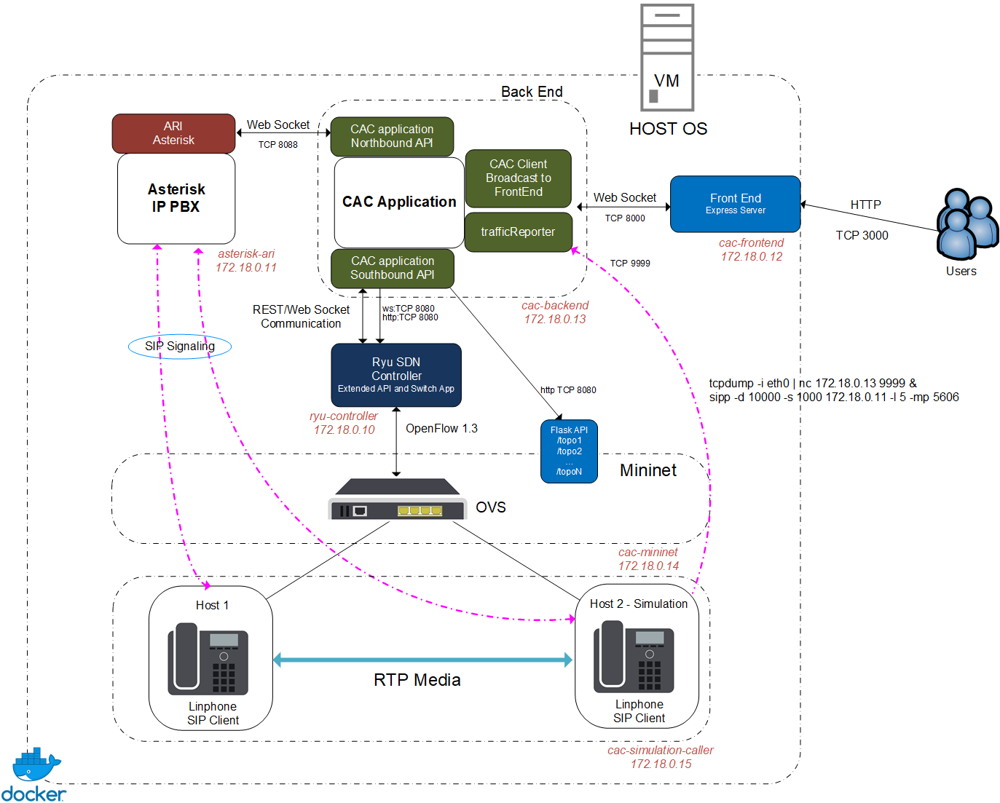

# Real-time QoS and Call admission Control in SDN networks


Implementation of quality of service and call admission control features within sdn network. This implementation use Ryu Framework (https://ryu-sdn.org/) to develop controller applications based on OpenFlow v1.3. Features are integrated with an Asterisk service through ARI API via websockets+rest. Application behaviour is exposed via a basic Front End service developed with node.js.

Application architecture is shown in the figure below.




**Table of contents**

- [Requirements](#requirements)
- [Getting Started](#gettingstarted)
- [Deployment](#deployment)
  - [Building](#building)
  - [Docker deployment](#docker-container-dployment)
  - [docker-compose deployment](#docker-compose-deployment)
- [Examples](#examples)
- [References](#references)

## Requirements
Some of the requirements to run this project simulations and stack are:

- Ryu Framework
- Mininet
- GNS3
- OpenVirtualSwitch (aka: OVS)
- Docker
- Docker-compose
- Python3

## Getting Started
Clone repository

```bash
$ git clone git@github.com:joagonzalez/sdn-qos.git
$ mkproject sdn-qos
$ workon sdn-qos
$ pip install -r requirements.txt within each python service
```

Directory structure of application

```
.
├── application
│   ├── asterisk
│   │   └── conf
│   ├── call-admission-control
│   │   └── src
│   │       ├── backend
│   │       │   ├── libs
│   │       │   └── src
│   │       ├── frontend
│   │       │   └── src
│   │       └── mocks
│   │           ├── ari
│   │           └── ryu
│   ├── conf
│   │   ├── ari.conf
│   │   ├── extensions.conf
│   │   └── sip.conf
│   ├── mininet
│   │   └── topologies
│   ├── ryu
│   │   └── applications
│   └── simulation
└── documentation
    ├── architecture
    │   ├── diagrams
    │   │   └── Paper diagrams
    │   └── modules
    │       ├── astersik
    │       │   ├── conf
    │       │   └── scripts
    │       └── ryu
    │           ├── api
    │           └── scripts
    └── mockups

34 directories
```

## Deployment

### Building
```bash
# for each service
docker build -t <service> .
```

### Containers deployment
```bash
# for each service
docker service create --network sdn-qos --publish <PORT-EXT:PORT-INT> --name <SERVICE> 
```

## Simulations
**Run application simulation**
```bash
cd application
docker-compose -f docker-compose-simulation.yml up -d
docker ps
open http://localhost:3000
```

**Run QoS simulation**

Script *sdn-qos-RealTimeQueues.py* implements an automated test where packet prioritization could be achieve using ryu controller with mininet and ovs.

Run locally installed Ryu framework
```
workon ryu
python3 ./bin/ryu-manager --observe-links ryu.app.rest_topology ryu.app.ws_topology ryu.app.ofctl_rest ryu.app.qos_simple_switch_13_CAC ryu.app.qos_simple_switch_rest_13_CAC ryu.app.rest_conf_switch ryu.app.rest_qos ryu.app.gui_topology.gui_topology
```

Run mininet script
```bash
cd application/mininet
sudo python2.7 sdn-qos-RealTimeQueues.py 
```


**Run application with external infrastructure** 

External components (Asterisk, OVS, SIP Clients) are not included within docker-compose.yml.

```bash
cd application
docker-compose -f docker-compose.yml up -d
docker ps
open http://localhost:3000
```

Then, you will have to update configuration file in application/call-admission-control/src/backend/src/config/settings.py. Specifically, asterisk data.

```json
config = {
  "ari": {
    "host": "http://asterisk:8088/",
    "username": "asterisk",
    "password": "asterisk",
  },
  "ryu": {
    "baseurl": "http://ryu:8080",
  },
  "frontService": {
    "host": "call_admission_control_backend",
    "listen": 8000
  },
  "client": {
    "baseurl": "ws://call_admission_control_backend:8000",
  }
}
```

## References
- http://mininet.org/
- https://ryu-sdn.org/
- https://github.com/faucetsdn/ryu
- https://www.opennetworking.org/
- https://iperf.fr/

